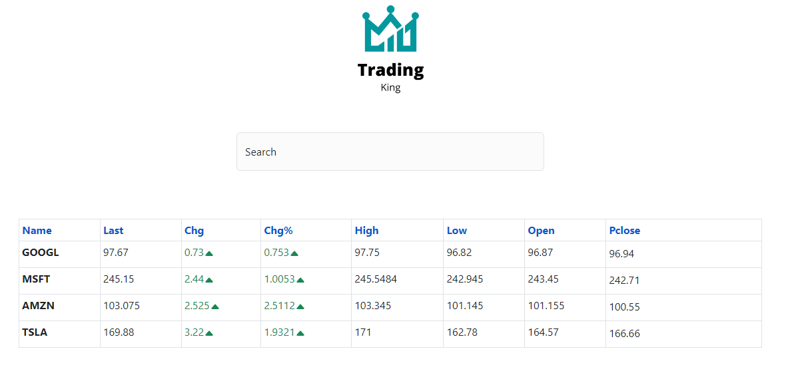

# Trading app

## Screenshot


Trading app in which you can see the financial data of the companies, it has a search engine, when selecting a company it is added to the table and clicking on the company redirects you to a page with more details of the company, showing a graph with the data of the last 24 hours, 1 week and 1 year, in which the color of the graph changes depending on whether the value goes up or down.

### Built With
* 
* 
* ApexCharts
* React-icons
* React-router-dom
* Axios

## Installation
Clone project 
```
  git clone https://github.com/Brayanro/trading-app.git
```

Install dependencies
```
  yarn install or npm install
```

Run proyect in development
```
  yarn dev or npm run dev
```

## Contact
(mailto:brayan7890123@gmail.com)